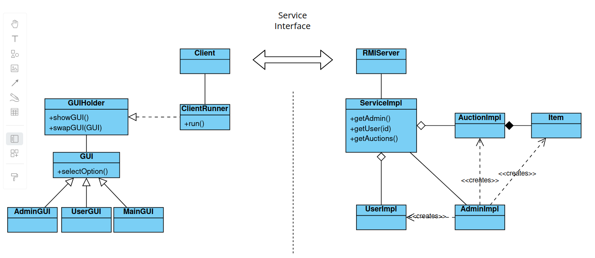

# Remote Auction System based on Java RMI

### Online Auctions - Brief Description and Instructions 
The online auction service is launched and made available on the network. Any client can connect to the service. A client with a special key can gain access to the Administrator account. The Administrator creates auction Items, Auctions, and Users. Clients can also in to their dedicated User accounts. After logging in, they should top up their Wallet with new funds. Then, they can browse Auctions and the Items listed on them. Users join Auctions and bid until the time runs out. The server displays auction information (on the website or in the console): item description, current price, and the list of bidders. If someone wants to bid, they submit their maximum price, and the system places them on the list of bidders. If their bid is the highest, it is recorded, and they become the leader. When the Auction closes, the item being auctioned goes to the bidder who offered the highest amount.

### Docs:
[Docs of Auction Service Library (Service Interface)](docs)
<ins>[Docs of Auction Service (Client)]</ins>
<ins>[Docs of Auction Service (ServiceImpl)]</ins>

### Logical Structure of the Application

### The interface of the auction service provides:
#### Administrative Functions (Admin)
- Creating Users: Admin can create new users with their username and password.
- Creating Items: Admin can create new auction items, defining their name and initial value.
- Creating Auctions: Admin can create auctions for existing items, defining the start and end time of the auction.
- Data Management: Admin can access the list of all users, items and auctions.

#### Auction Functions
- Bidding: Users can place bids on items up for auction.
- Notifications: The system can send notifications to all auction participants.
- Bid Tracking: The auction stores information about the highest bid and the user who placed the bid.
- Auction Status: An auction has different statuses (new, open, closed) that reflect its current status.

#### User Functions (User)
- Logging in: Users can log in to the system with their username and password.
- Placing Bids: Users can place bids in auctions, either directly or by providing an auction ID.
- Managing Credits: Users can top up their credit account using special BL1K codes.
- Receiving Items: After the auction ends, users can pick up the auctioned items (they are transferred to them automatically).

#### General Service Features (Service)
- Auction List: Everyone can view the list of available auctions.
- Login Interface: Provides a login interface, providing an Administrator or User account.
